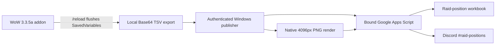

  

<h1 align="center">Pizza Warriors Raid Planner</h1>

  Pre-fight Blood Prince Council and Blood-Queen Lana'thel planning for the original Wrath 3.3.5a client.

  
  
  
  

  <a href="../../releases/latest"><strong>Download the latest release</strong></a>
  ·
  <a href="docs/ADAPTATION_GUIDE.md">Adapt it for your raid</a>
  ·
  <a href="docs/ARCHITECTURE.md">Read the architecture</a>

  

> [!IMPORTANT]
> This is the source-available Pizza Warriors reference implementation—not a universal plug-and-play addon. Its encounter rules, workbook geometry, and publishing workflow reflect one raid team's strategy. Fork it and deliberately adapt those contracts before using it with another group.

## From one benchmark to two published plans

Pizza Warriors Raid Planner captures raid composition and damage evidence inside Icecrown Citadel, saves valid Festergut kills as reusable benchmarks, and produces reviewable assignments before the pull. A companion Windows publisher transfers the chosen plan into a raid-position workbook and publishes native 4096px encounter images to Discord.

| Planner | Output |
|---|---|
| **Festergut history** | Persistent DPS and roster snapshots that can be selected for rehearsal |
| **Blood Prince Council** | Valanar-active positions, Kinetic Bomb coverage, Divine Sacrifice, and Fire Aura Mastery |
| **Blood-Queen Lana'thel** | Position-aware bite tree, R1/R6 ranged anchors, Rogue/DPS-DK Middle rules, side Retribution groups, Pact Shadow AM, and Airphase DSac |
| **Desktop publisher** | Values-only workbook updates plus crisp 4K BPC/BQL Discord images with transparent outer margins |

The BQL tree uses the second bite to establish the opposite ranged side, the third bite to seed one melee branch per side, and the final rounds to prefer same-role, same-side, then same-class/spec pairings. Bite targets move to stationary biters and return home afterward. Persisted Festergut selections are rebuilt on login so an older cached plan cannot survive a rules update.

## System map

The addon itself never contacts Google or Discord and never performs protected gameplay actions. Network access begins only when the user launches the external desktop publisher after WoW has written SavedVariables.

## Repository layout

| Path | Purpose |
|---|---|
| Root Lua files and `Media/` | Loadable WoW addon |
| `tools/DiscordPost.gs` | Bound Apps Script workbook endpoint |
| `tools/Sync-PizzaRaidPlannerToSheets.ps1` | Authenticated desktop transfer and 4K renderer |
| `tests/` | Offline Lua, JavaScript, and PowerShell regression tests |
| `scripts/` | Secret gate and deterministic release builder |
| `docs/` | Adaptation, architecture, compatibility, and validation guides |

## Start here

1. Read the [adaptation guide](docs/ADAPTATION_GUIDE.md).
2. Fork the repository under the included noncommercial license.
3. Replace the Pizza Warriors name and emblem with your own branding.
4. Adapt the BPC/BQL strategy rules and workbook ranges to your raid.
5. Run the secret gate and all offline tests before deploying anything.
6. Build separate addon and desktop release archives with `scripts/Build-Release.ps1`.

The public source contains no Discord webhook, deployment URL, upload token, live workbook ID, WoW account name, or SavedVariables history. Each fork binds itself to its own workbook during first-time setup.

## Security boundaries

- Desktop requests require a randomly generated 64-character token.
- The token is stored with Windows user encryption and never enters addon SavedVariables.
- The Apps Script endpoint accepts only fixed actions, sheets, and ranges.
- TSV cells are neutralized against spreadsheet formula injection.
- Two-stage publish tickets bind validated PDFs and PNGs to one exact plan.
- Discord receives only server-validated PNG payloads within fixed dimensions and size limits.
- Duplicate fingerprints prevent the same flushed plan from being posted twice.

See [SECURITY.md](SECURITY.md) for reporting and [docs/ARCHITECTURE.md](docs/ARCHITECTURE.md) for the trust model.

## Compatibility

- World of Warcraft client interface `30300` (Wrath 3.3.5a)
- Optional ElvUI styling
- Optional Skada damage integration
- Windows PowerShell 5.1+
- Google Sheets with a bound Apps Script project
- A Discord channel webhook controlled by the adapting raid team

Warmane and other private-server combat-log behavior must be validated in game. Offline tests confirm the planner's contracts but cannot prove a server's spell identifiers or encounter events.

## Ownership and license

Copyright © 2026 Neil Mitchell. The software is available under the [PolyForm Noncommercial License 1.0.0](LICENSE.md) with the required notices in [NOTICE.md](NOTICE.md).

You may fork, study, adapt, and distribute it for noncommercial purposes under those terms. Commercial use is not granted. The **Pizza Warriors** name, emblem, and visual identity are reserved and are not licensed for use in derivative branding.

This upstream repository does not accept commits, issues, or pull requests. Approved releases are archived read-only; users may download or fork them. See [CONTRIBUTING.md](CONTRIBUTING.md) and [docs/REPOSITORY_POLICY.md](docs/REPOSITORY_POLICY.md).

World of Warcraft and Warcraft are trademarks of Blizzard Entertainment. This project is an independent community tool and is not affiliated with or endorsed by Blizzard Entertainment.
