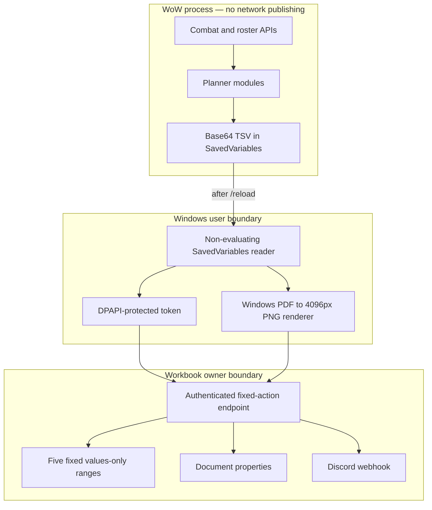

# Architecture

## Responsibility

Pizza Warriors Raid Planner separates in-game evidence collection from out-of-game publishing. The addon owns roster, encounter, benchmark, assignment, review, and export logic. The desktop publisher owns local SavedVariables extraction and 4K rendering. The bound Apps Script owns fixed workbook updates and the Discord webhook.

## Trust boundaries

## Modules

### In-game addon

- `ICCSession.lua` starts and resumes bounded ICC sessions.
- `Damage.lua` records valid encounter evidence and Festergut benchmarks.
- `Roster.lua`, `Roles.lua`, and `SkadaAdapter.lua` resolve composition evidence.
- `BPC.lua`, `BQL.lua`, and `Optimizer.lua` construct deterministic plans.
- `PlanBundle.lua` fingerprints the planning roster and generates BPC/BQL as one revision; it also owns post-Festergut roster-audible diffs and benchmark provenance.
- `Export.lua` creates exact TSV rectangles and Base64 SavedVariables fields.
- `UI.lua` exposes review and copy surfaces without protected actions.

### Desktop boundary

`Sync-PizzaRaidPlannerToSheets.ps1` reads only quoted Base64 fields. It never evaluates Lua. It verifies freshness and export markers, sends an authenticated bounded request, receives cropped vector PDFs, renders them with Windows' built-in PDF engine, converts only detected outer white margins to transparency without resizing, and returns exact PNG bytes.

### Workbook boundary

`DiscordPost.gs` is a bound Apps Script. First-time configuration records its current workbook ID in document properties; the public source has no live workbook identifier. The web endpoint accepts a fixed action list and updates only declared sheets and ranges.

## Publish transaction

1. Desktop validates that the roster is clean and BPC/BQL carry the same bundle ID, revision, and roster fingerprint, then merges their TSV.
2. Apps Script authenticates the token and validates the TSV contract.
3. Apps Script updates five fixed live ranges and returns cropped PDFs plus a random publish ticket.
4. Windows renders native-width PNGs and verifies dimensions and attachment limits.
5. Apps Script binds the returned images to the ticket and exact plan fingerprint.
6. Discord receives one webhook request containing both validated files.
7. The server records the post fingerprint so the same flushed plan cannot post twice.

Ambiguous post states are finalized conservatively without automatic reposting.

## Benchmark and audible contract

New Festergut segments must contain explicit boss-death evidence before they can become selectable benchmarks. Wipes and incomplete pulls remain in history for diagnosis. Legacy history created before this evidence field existed is retained and labelled separately.

`/prp audible` compares the current raid with the last plan roster. Both encounters are regenerated from that one roster. Current/selected Festergut player samples remain authoritative; an incoming player may fall back only to that player's prior Festergut sample from the same class and spec. No ICC-wide average participates in either encounter. A new ICC session, confirmed Festergut benchmark, planner version, or roster fingerprint invalidates a current-mode bundle. Logout exports that stale pair as dirty rather than silently rebuilding it.

## Adaptation contracts

Changing a worksheet range requires coordinated updates to `Export.lua`, `DiscordPost.gs`, PowerShell merge anchors, tests, and documentation. Changing raid strategy should remain inside the planner modules and preserve deterministic output ordering.
